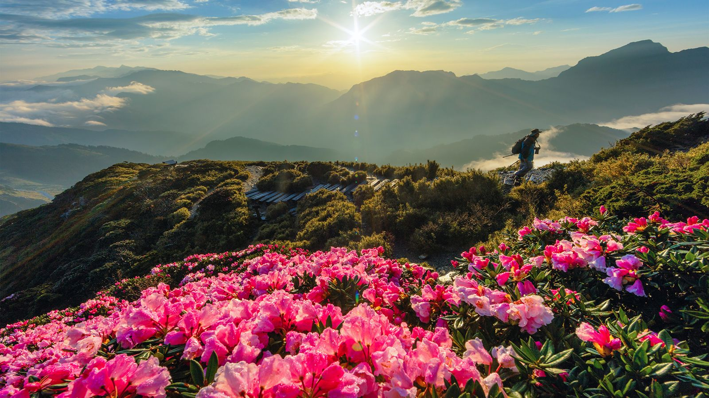

# Welcome to "Traveling the World with Kids" Blog!

# 

  

Hi, We are the CharMing family, and this is our travel blog where we share my experiences from exploring the world with our kids. From the bustling streets of Tokyo to the serene beaches of Bali, We will take you on a journey to discover new places, cultures, and adventures.

## Recent Posts

  * [{{ post.title }}]({{ post.url }}) - {{ post.date | date: "%B %d, %Y" }}

